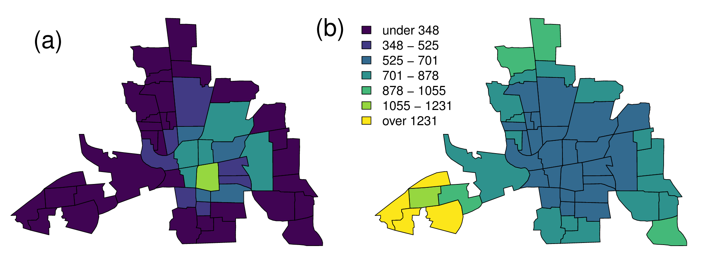
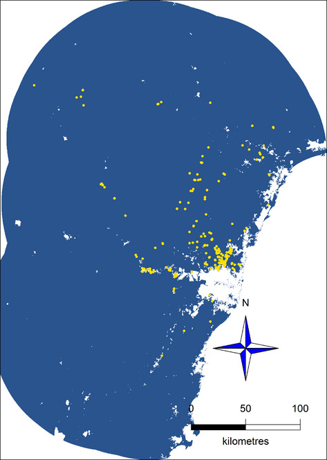
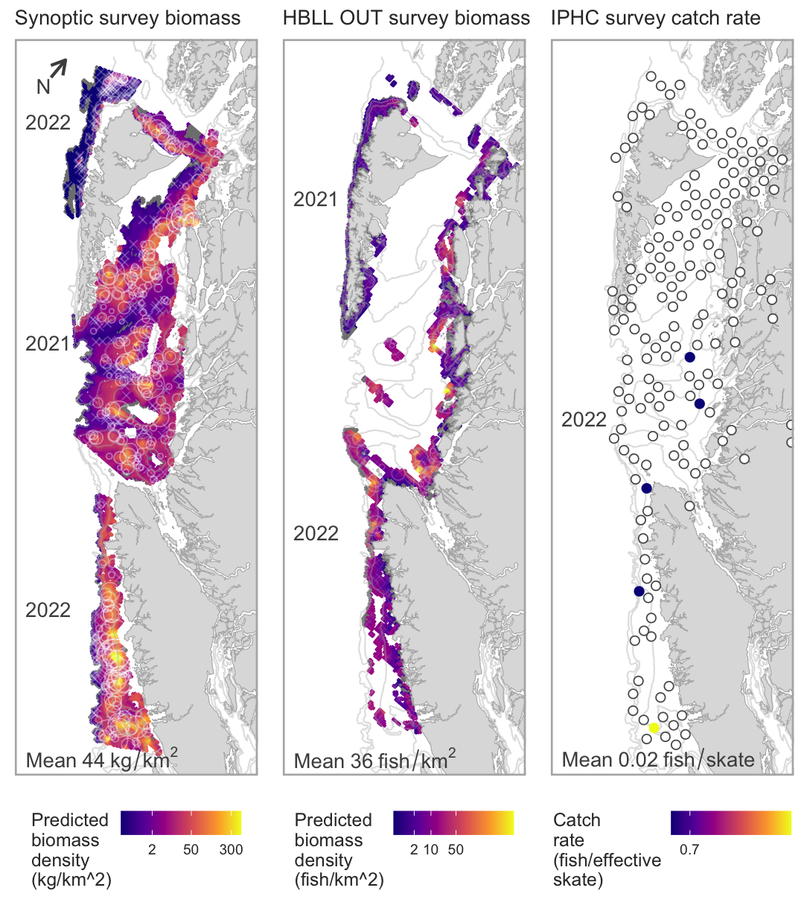
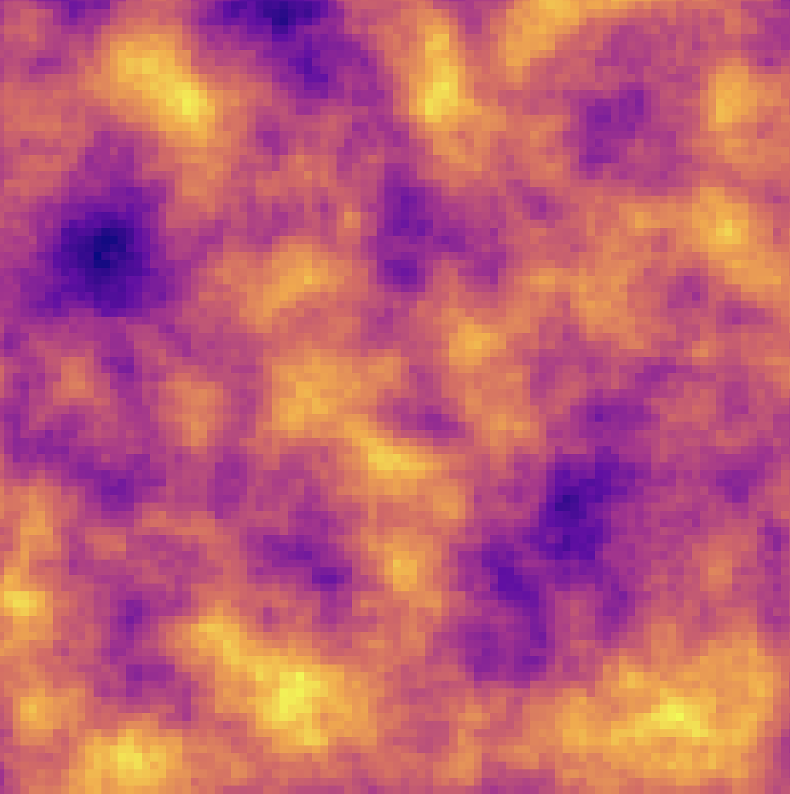
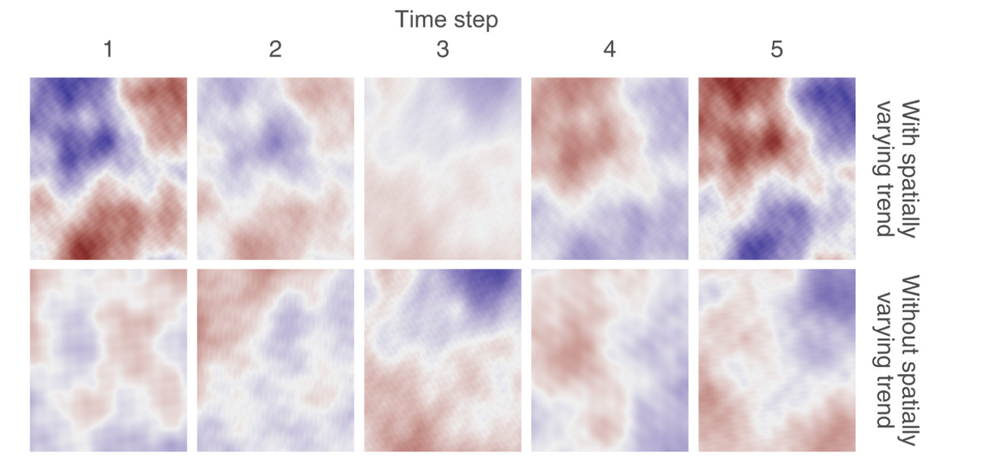
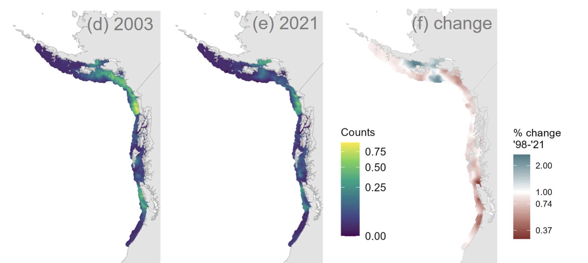
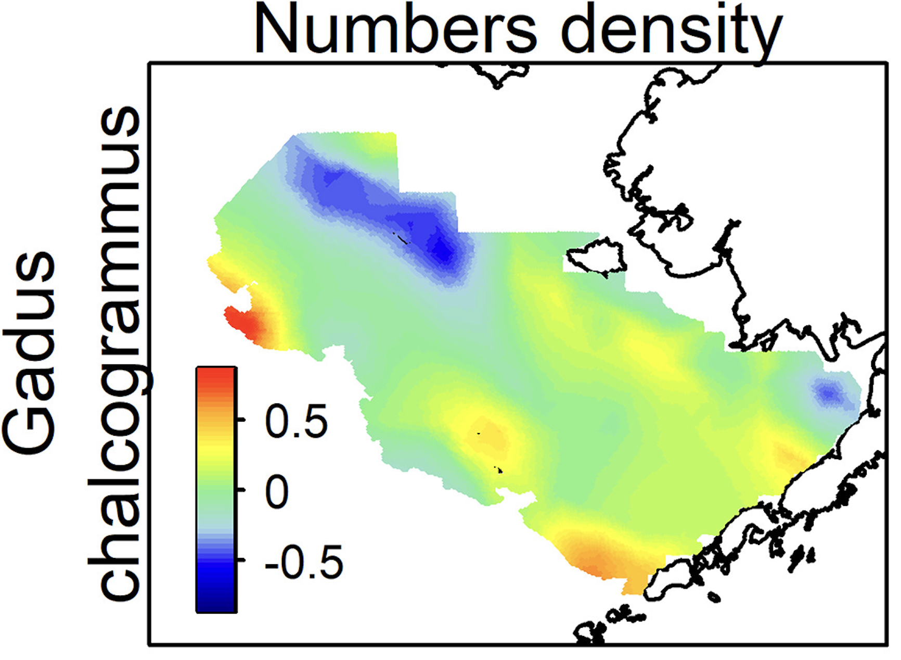
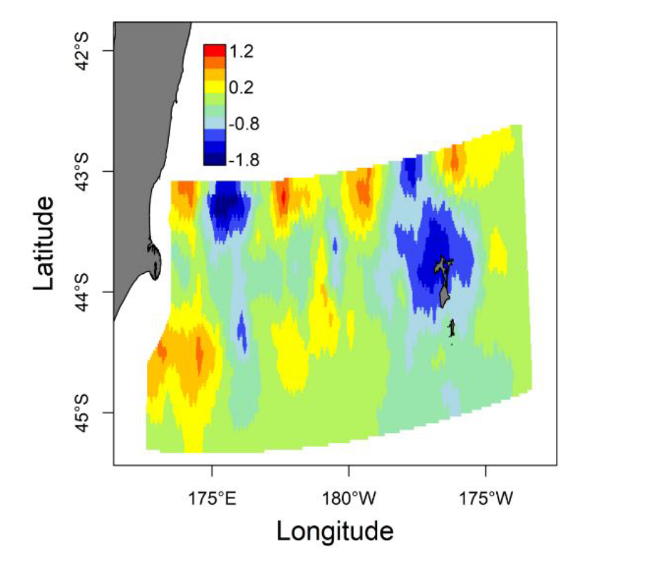

<!-- Build with: xaringan::inf_mr() -->

```{r preamble, include=FALSE, cache=FALSE}
xaringanthemer::style_mono_accent(
  base_color = "#202020",
  header_font_google = xaringanthemer::google_font("Raleway"),
  text_font_google = xaringanthemer::google_font("Open Sans"),
  code_font_google = xaringanthemer::google_font("Fira Mono"),
  title_slide_background_image = "images/logo-sdmTMB.png",
  title_slide_background_size = "14%",
  title_slide_background_position = "50% 90%",
  base_font_size = "20px",
  header_h1_font_size = "2.1rem",
  text_font_size = "1.5rem",
  code_font_size = "1.1rem",
  link_color = "#0047AB"
)
knitr_opts <- list(
  message = FALSE,
  warning = FALSE,
  collapse = TRUE,
  comment = "#>",
  fig.width = 7,
  dpi = 300,
  out.width = "700px",
  fig.asp = 1 / 1.618,
  cache = TRUE,
  autodep = TRUE,
  cache.comments = TRUE,
  fig.align = "center",
  echo = FALSE
)
do.call(knitr::opts_chunk$set, knitr_opts)
```

```{r libs, include=FALSE}
library(ggplot2)
library(dplyr)
library(sdmTMB)
options(ggplot2.continuous.colour = "viridis")
options(ggplot2.continuous.fill = "viridis")
ggplot2::theme_set(ggplot2::theme_minimal())
```

# Download the files

https://github.com/seananderson/RTMB-TESA-spatial

.xsmall[
Look at README.md and make sure you have the packages installed.

I'll also post the files on the ICES page.
]

```{r download, out.width = '53%'}
knitr::include_graphics("images/download-zip.jpg")
```

---

# Plan

.small[
1. Introduction to types of spatial data and models

1. Introduction to Gaussian random fields

1. Exercise: Fitting random fields with `dmvnorm()` in RTMB

1. Introduction to the SPDE approach with GMRFs

1. Exercise: Using the SPDE approach with GMRFs in RTMB

1. Exercise: Using the SPDE approach with a non-linear growth model in RTMB

1. Spatially varying coefficients + small exercise

1. If time: spatiotemporal models + code
]

---

# Types of spatial data

### Areal/Lattice

Values are observed on a grid or set of subregion polygons.

```{r car, out.width = '80%'}

```

.tiny[
Ver Hoef, J.M., Hanks, E.M., and Hooten, M.B. 2018. On the relationship between conditional (CAR) and simultaneous (SAR) autoregressive models. Spatial Statistics 25: 68–85. doi:10.1016/j.spasta.2018.04.006.
]

---

# Types of spatial data

### Point Process

Observations of a continuous spatial process where the variable of interest is the location of the events.

```{r pp, out.width = '20%'}

```

.tiny[
Renner, I.W., Elith, J., Baddeley, A., Fithian, W., Hastie, T., Phillips, S.J., Popovic, G., and Warton, D.I. 2015. Point process models for presence‐only analysis. Methods Ecol Evol 6(4): 366–379. doi:10.1111/2041-210X.12352.
]

---

# Types of spatial data

### Geostatistical 

Observations of a continuous spatial process observed at a chosen set of points. .tiny[*We're focusing on geostatistical models.]

```{r geodat, out.width = '47%'}

```

---

# Motivation for spatially explicit models

Data often have spatial attributes.

In an ideal world:
1. Plug spatial covariates into a GLM / GLMM
2. Residuals are uncorrelated
  
```{r sim-rf-intro, echo=FALSE, fig.asp=0.4}
set.seed(123)
predictor_dat <- data.frame(
  X = runif(300), Y = runif(300),
  year = 1
)
mesh <- make_mesh(predictor_dat,
  xy_cols = c("X", "Y"),
  cutoff = 0.1
)
sim_dat <- sdmTMB_simulate(
  formula = ~1,
  data = predictor_dat,
  time = "year",
  mesh = mesh,
  family = gaussian(link = "identity"),
  range = 0.00001,
  sigma_E = 0.1,
  phi = 0.01,
  sigma_O = 0.2,
  seed = 3542,
  B = c(0) # B0 = intercept
)
ggplot(sim_dat, aes(X, Y, col = observed)) +
  geom_point(alpha = 0.7, size = 3) +
  guides(col = guide_legend(title = "Residuals")) +
  scale_color_gradient2()
```

---

# Reality
  
Residual spatial autocorrelation is pervasive in geostatistical data.

Alternatively, there are unmodelled, missing, or "latent" spatially structured variables.

```{r sim-rf-intro-cor, echo=FALSE, fig.asp=0.4}
set.seed(123)
predictor_dat <- data.frame(
  X = runif(300), Y = runif(300),
  year = 1
)
mesh <- make_mesh(predictor_dat,
  xy_cols = c("X", "Y"),
  cutoff = 0.1
)
sim_dat <- sdmTMB_simulate(
  formula = ~1,
  data = predictor_dat,
  time = "year",
  mesh = mesh,
  family = gaussian(link = "identity"),
  range = 0.25,
  sigma_E = 0.1,
  phi = 0.01,
  sigma_O = 0.1,
  seed = 3542,
  B = c(0) # B0 = intercept
)
ggplot(sim_dat, aes(X, Y, col = observed)) +
  geom_point(alpha=0.7, size=3) + 
  guides(col=guide_legend(title="Residuals")) +
  scale_color_gradient2()
```

---

# Modeling latent spatial variables

Need a 'wiggly' surface for approximating all missing spatially structured variables

Several approaches exist. For example:
  * 2D smoothers with GAMs (e.g., mgcv)
  * Gaussian random fields
  * Random forests etc.

.tiny[
Miller, D.L., Glennie, R., and Seaton, A.E. 2019. Understanding the Stochastic Partial Differential Equation approach to smoothing. JABES.

Stock, B.C., Ward, E.J., Eguchi, T., Jannot, J.E., Thorson, J.T., Feist, B.E., and Semmens, B.X. 2019. Comparing predictions of fisheries bycatch using multiple spatiotemporal species distribution model frameworks. CJFAS.
]

---

# Why focus on Gaussian random fields?

Random fields are nice because

1. They are very flexible in the shapes they can fit
2. They can be fit efficiently
3. They estimate ecologically interpretable parameters

```{r rf-eg, out.width = '30%'}

```

---

# What is a random field?

```{r sim-rf-dat, message=FALSE, warning=FALSE}
predictor_dat <- expand.grid(
  x = seq(0, 1, length.out = 100),
  y = seq(0, 1, length.out = 100),
  year = seq_len(6)
)
mesh <- make_mesh(predictor_dat, xy_cols = c("x", "y"), cutoff = 0.05)
sim_dat <- sdmTMB_simulate(
  formula = ~1,
  data = predictor_dat,
  time = "year",
  mesh = mesh,
  family = gaussian(),
  range = 0.5,
  sigma_E = 0.2,
  phi = 0.1,
  sigma_O = NULL,
  seed = 1,
  B = 0
)
```

```{r random-field-demo}
ggplot(sim_dat, aes(x, y, fill = mu)) +
  facet_wrap(vars(year)) +
  geom_raster() +
  scale_fill_gradient2() +
  coord_fixed(expand = FALSE)
```

---
background-image: url("images/eagle.png")
background-position: bottom right
background-size: 35%

# Random field


---
background-image: url("images/beaker.png")
background-position: bottom right
background-size: 35%

# Random field

A 2 dimensional "Gaussian Process".

--

A realization from a multivariate normal distribution constrained by some covariance function.

---
background-image: url("images/elmo.png")
background-position: bottom right
background-size: 30%

# Random field

A way of estimating a wiggly surface to account for spatial and/or spatiotemporal correlation in data.

--

Alternatively, a way of estimating a wiggly surface to account for unobserved spatially structured variables.

--

As a bonus, it provides useful parameter estimates: spatial variance (magnitude of wiggles) and the rate at which data become uncorrelated with distance (how smooth are the wiggles).

---

# Correlation/covariance functions

- These constrain the random field MVN distribution.

--

- They define how correlation decays with distance.

--

- Can be isotropic or anisotropic.

--

- Common choices: exponential, Gaussian, Matérn.

--

- We'll start with exponential and Gaussian.

--

- We'll come back to the Matérn.

---

# Exponential correlation

$$
\mathcal{C}\left(d\right) = e^{ -d/\rho }
$$

- $d$ is distance
- $\rho$ controls the rate of correlation decay with distance

```{r exp-cov, fig.asp=0.45}
exp_cor<- function(d, rho = 0.2) exp(-d/rho)
d <- data.frame(x = seq(0, 1, length.out = 300))
d1 <- data.frame(x = d$x, y = exp_cor(d$x, rho = 0.2), rho = 0.2)
d2 <- data.frame(x = d$x, y = exp_cor(d$x, rho = 0.1), rho = 0.1)
d3 <- data.frame(x = d$x, y = exp_cor(d$x, rho = 0.4), rho = 0.4)

dplyr::bind_rows(list(d1, d2, d3)) |> 
  ggplot(aes(x, y, colour = rho, group = rho)) + geom_line() + 
  labs(y = "Correlation", x = "Distance") +
  coord_cartesian(expand = FALSE)
```

---

### Gaussian or squared exponential correlation

$$
\mathcal{C}\left(d\right) = e^{ -\left(d/\rho\right)^{2} }
$$
- $d$ is distance
- $\rho$ controls the rate of correlation decay with distance

```{r gauss-cov, fig.asp=0.45}
gaus_cor<- function(d, rho = 0.2) exp(-(d/rho)^2)
d <- data.frame(x = seq(0, 1, length.out = 300))
d1 <- data.frame(x = d$x, y = gaus_cor(d$x, rho = 0.2), rho = 0.2)
d2 <- data.frame(x = d$x, y = gaus_cor(d$x, rho = 0.1), rho = 0.1)
d3 <- data.frame(x = d$x, y = gaus_cor(d$x, rho = 0.4), rho = 0.4)
dplyr::bind_rows(list(d1, d2, d3)) |> 
  ggplot(aes(x, y, colour = rho, group = rho)) + geom_line() + 
  labs(y = "Correlation", x = "Distance") +
  coord_cartesian(expand = FALSE)
```

---

class: center, middle, inverse

# Exercise: Direct estimation of a Gaussian random field with exponential covariance

---

# Direct estimation of a random field

1. Fill in a correlation matrix

2. Convert to a covariance matrix

3. Calculate log likelihood with `dmvnorm()`

---

# Direct estimation of a random field exercise

See `exercises/01-spatial-dmvnorm-exercise.R`.

We'll walk through the first part together.

Fill in the exponential correlation and fit the model. $\mathcal{C}\left(d\right) = e^{ -d/\rho }$.

With your neighbour, answer the questions at the bottom of the file.

---

class: center, middle, inverse

# Faster approaches:  
# The Matérn, SPDE, and GRMFs

---

# Approaches to speeding this up

- Grid the observations into areal data

- Predictive processes

- Covariance tapering 

- Nearest-neighbour

- SPDE-approach and GRMFs*

.xsmall[*We're focussing here today: it's fast, estimates useful spatial parameters, popular, and integrates easily with RTMB.]

---

# The SPDE approach

.xsmall[
- SPDE: Stochastic Partial Differential Equation
]

--

.xsmall[
- A solution to a specific SPDE allows computing a precision matrix of a Gaussian *Markov* random field (GMRF) that is a good approximation to a Gaussian random field with **Matérn** covariance.
]

--

.xsmall[
- We can estimate this sparse precision matrix efficiently in RTMB.
]

--

.xsmall[
- In short: the SPDE approach lets us efficiently estimate approximate Gaussian random fields by letting us work with GMRFs and their precision matrix.
]

--

.tiny[
Lindgren, F., Rue, H., and Lindström, J. 2011. An explicit link between Gaussian fields and Gaussian Markov random fields: the stochastic partial differential equation approach. Journal of the Royal Statistical Society: Series B (Statistical Methodology) 73(4): 423–498.

Miller, D.L., Glennie, R., and Seaton, A.E. 2019. Understanding the Stochastic Partial Differential Equation approach to smoothing. JABES. doi:10.1007/s13253-019-00377-z.
]

---

# An aside on the Matérn covariance

.xsmall[
$$
\mathcal{C} \left(d \right) = \frac{\sigma^2}{2^{\nu - 1}\Gamma(\nu)}
    (\kappa d)^\nu K_\nu \kappa d \quad 😱
$$
]

.xsmall[
- $d$ = distance
- $\Gamma$ = the gamma function
- $K_\nu$ = modified Bessel function of the 2nd kind(!)
- $\kappa$ = decorrelation rate
- $\sigma^2$ = variance
- $\nu$ is fixed at 1 to take advantage of SPDE
]
 
```{r matern-plot, fig.asp=0.51, fig.width=3.8, out.width = "450px",}
x <- seq(from = 0, to = 1.5, length.out = 300)
df <- data.frame(
  x = rep(x, 4),
  nu = sort(rep(c(0.5, 1, 2, 10), 100))
)
df$row <- seq(1, nrow(df))
df <- dplyr::group_by(df, row) |> 
  dplyr::mutate(
    cov =
      rSPDE::matern.covariance(h = x, kappa = 5, nu = nu, sigma = 1)
  )
df$nu <- as.factor(df$nu)
ggplot(df, aes(x, cov, col = nu, group = nu)) +
  geom_line() +
  xlab("Distance") +
  ylab("Covariance") +
  # ggtitle("Matérn covariance") +
  guides(col = guide_legend(title = expression(nu))) +
  # theme(text = element_text(size = 21)) +
  coord_cartesian(expand = FALSE)
```

---

# Matérn covariance range

Range = distance correlation has decayed to $\sim$ 0.13.

$\mathrm{range} = \sqrt{8 \nu} / \kappa$, so if $\nu = 1$, $\mathrm{range} = \sqrt{8} / \kappa$

```{r matern-range, warning=FALSE, message=FALSE, fig.asp=0.35}
predictor_dat <- expand.grid(
  x = seq(0, 1, length.out = 100),
  y = seq(0, 1, length.out = 100),
  year = seq_len(1)
)
sim_mesh <- make_mesh(predictor_dat, xy_cols = c("x", "y"), cutoff = 0.01)
s1 <- sdmTMB_simulate(
  formula = ~1,
  data = predictor_dat,
  mesh = sim_mesh,
  range = 0.2,
  phi = 0.1,
  sigma_O = 0.2,
  seed = 1,
  B = 0
)
sim_g1 <- ggplot(s1, aes(x, y, fill = mu)) +
  geom_raster(show.legend = FALSE) +
  scale_fill_viridis_c(option = "C") +
  # coord_fixed(expand = FALSE) +
  coord_cartesian(expand = FALSE) +
  theme_light() +
  # theme(axis.title = element_blank()) +
  ggtitle("(a) Range = 0.2") +
  labs(x = "X", y = "Y")

s2 <- sdmTMB_simulate(
  formula = ~1,
  data = predictor_dat,
  mesh = sim_mesh,
  range = 0.6,
  phi = 0.1,
  sigma_O = 0.2,
  seed = 1,
  B = 0
)
sim_g2 <- ggplot(s2, aes(x, y, fill = mu)) +
  geom_raster(show.legend = FALSE) +
  scale_fill_viridis_c(option = "C") +
  coord_cartesian(expand = FALSE) +
  # coord_fixed(expand = FALSE) +
  theme_light() +
  # theme(axis.title = element_blank()) +
  ggtitle("(b) Range = 0.6") +
  labs(x = "X", y = "Y")

x <- seq(0, 1, length.out = 200)
r <- seq(0.2, 1, 0.2)
r <- c(0.2, 0.6)
df <- data.frame(
  x = rep(x, length(r)),
  range = rep(r, each = length(x))
)
matern <- function(h, sigma = 1, kappa, nu = 1) {
  ret <- (sigma^2/(2^(nu - 1) * gamma(nu))) *
    ((kappa * abs(h))^nu) *
    besselK(kappa * abs(h), nu)
  ret
  ret[x == 0] <- sigma^2
  ret
}
blues <- RColorBrewer::brewer.pal(length(r) + 1, "Blues")[-1]
df$cor <- matern(df$x, kappa = sqrt(8) / df$range)
sim_g3 <- ggplot(df, aes(x, cor, col = as.factor(range), group = as.factor(range))) +
  geom_line() +
  theme_light() +
  xlab("Distance") +
  ylab("Correlation") +
  labs(colour = "Range") +
  coord_cartesian(expand = FALSE, ylim = c(0, 1)) +
  scale_colour_manual(values = blues) +
  geom_hline(yintercept = 0.13, col = "grey50", lty = 2) +
  scale_x_continuous(breaks = r) +
  theme(legend.position = c(0.7, 0.7)) +
  ggtitle("(c) Matérn correlation function")

cowplot::plot_grid(sim_g1, sim_g2, sim_g3, align = "h", ncol = 3L)
```

.tiny[
Lindgren, F., Rue, H., and Lindström, J. 2011. An explicit link between Gaussian fields and Gaussian Markov random fields: the stochastic partial differential equation approach. Journal of the Royal Statistical Society: Series B (Statistical Methodology) 73(4): 423–498.
]

---

# SPDE approach: what you need to know

The SPDE approach involves a triangulation over the area of interest; we call this a "mesh".

.small[

```{r loc}
loc <- as.matrix(sdmTMB::pcod[,c("X", "Y")])
```

```{r mesh, echo=TRUE, fig.asp=1, out.width="350px"}
# loc is a 2-column matrix of x and y values
mesh <- fmesher::fm_mesh_2d(loc = loc, cutoff = 5)
plot(mesh)
```
]

---

# Mesh construction

.xsmall[
Part art, part science; guidance is frustratingly sparse!

A unique mesh is generally made for each dataset.

Rules of thumb:
  * More triangles = more computation time
  * More triangles = more fine-scale spatial predictions
  * Finer resolution isn't always better
  * Borders with coarser resolution reduce number of triangles
  * Use `cutoff` (minimum edge length) to avoid too fine meshes
  * Triangle edge size needs to be smaller than spatial range

"How to make a bad mesh?" [Haakon Bakka's book](https://haakonbakkagit.github.io/btopic114.html)
]

---

# SPDE approach: what you need to know

With this mesh, we can calculate 3 sparse matrices needed to calculate the precision matrix $\boldsymbol{Q}$

$$
\boldsymbol{Q} = \tau^2 \left(\kappa^4\boldsymbol{C_0} + 2\kappa^2\boldsymbol{G}_1 + \boldsymbol{G}_2 \right),
$$
- $\boldsymbol{C_0}$, $\boldsymbol{G_1}$, and $\boldsymbol{G_2}$ are these sparse matrices
- $\tau$ scales the precision matrix
- $\kappa$ is the decorrelation rate as before

```{r fe-matrices, echo=TRUE}
spde <- fmesher::fm_fem(mesh)
names(spde)
```

---

# Getting back from $\tau$ to variance

.xsmall[
With this precision matrix representation of the Matérn, we need a way of converting from $\tau$ back to variance $\sigma^2$:
]

.small[
$\sigma^2 = \frac{1}{\left (4 \pi \tau^2 \kappa^2 \right)}$
]

.xsmall[
$\tau$ and $\kappa$ are parameters from the Matérn precision we will estimate.

Note that $\tau$ is inverse to $\sigma$.
]

```{r marg-variance, fig.asp=0.4}
predictor_dat <- expand.grid(
  x = seq(0, 1, length.out = 100),
  y = seq(0, 1, length.out = 100),
  year = seq_len(1)
)
sim_mesh <- make_mesh(predictor_dat, xy_cols = c("x", "y"), cutoff = 0.01)
.s1 <- sdmTMB_simulate(
  formula = ~1,
  data = predictor_dat,
  mesh = sim_mesh,
  range = 0.6,
  phi = 0.1,
  sigma_O = sqrt(1),
  seed = 1,
  B = 0
)
.s2 <- sdmTMB_simulate(
  formula = ~1,
  data = predictor_dat,
  mesh = sim_mesh,
  range = 0.6,
  phi = 0.1,
  sigma_O = sqrt(0.3),
  seed = 1,
  B = 0
)
lims <- range(c(.s2$mu, .s1$mu))

sim_g3 <- ggplot(.s1, aes(x, y, fill = mu)) +
  geom_raster(show.legend = FALSE) +
  scale_fill_viridis_c(option = "C", limits = lims) +
  # coord_fixed(expand = FALSE) +
  coord_cartesian(expand = FALSE) +
  theme_light() +
  # theme(axis.title = element_blank()) +
  ggtitle("(a) Variance = 1") +
  labs(x = "X", y = "Y")

sim_g4 <- ggplot(.s2, aes(x, y, fill = mu)) +
  geom_raster(show.legend = FALSE) +
  scale_fill_viridis_c(option = "C", limits = lims) +
  coord_cartesian(expand = FALSE) +
  # coord_fixed(expand = FALSE) +
  theme_light() +
  # theme(axis.title = element_blank()) +
  ggtitle("(b) Variance = 0.3") +
  labs(x = "X", y = "Y")
cowplot::plot_grid(sim_g3, sim_g4, align = "v")
```

---

# SPDE approach: what you need to know

.small[
We usually interpolate from the mesh vertices (the random effects) to any observation or prediction locations.

We'll visualize this when we work through the code...
]

```{r A-matrix, echo=TRUE}
A <- fmesher::fm_basis(mesh, loc = loc)
nrow(loc)
mesh$n
dim(A)
```

---
class: center, middle, inverse

background-image: url("images/flickr-9fTfup.jpg")
background-position: center
background-size: 100%

<div class="footer">CC BY-ND 2.0: https://flic.kr/p/9fTfup</div> 

---

# Putting it all together

.xsmall[
**Before fitting:**

1. Create a mesh
2. Calculate SPDE matrices
3. Calculate interpolation matrices
]

--

.xsmall[
**Within the model:**

1. Use your SPDE matrices to construct the precision matrix
2. Evaluate the likelihood of the GMRF
3. Project from random effect vertices to the data locations
4. Add in anything else you want (e.g., other parameter effects)
4. Evaluate the data likelihood
5. Project from random effects vertices to any new prediction locations
6. Calculate derived quantites such as range and marginal variance
]

---
class: center, middle, inverse

# Exercise: SPDE example with simulated data

02-spatial-spde-exercise.R

---

class: center, middle, inverse

# Exercise: SPDE example with Pacific Ocean Perch growth curve

03-growth.R

03-growth-spde-exercise.R

---

class: center, middle, inverse

# Going spatiotemporal!

---

# Spatially varying coefficient (SVC) models

.small[
- Let slope parameters vary spatially
- Data are usually constant in space but varying through time
- We can do this as long as these parameters are constrained somehow
- Gaussian random fields are perfect for this
- Common uses in fisheries + ecology:
  - local/spatially varying population trends
  - ecological teleconnections
  - spatially varying catchability
]

.tiny[
Gelfand, A.E., Kim, H.-J., Sirmans, C.F., and Banerjee, S. 2003. Spatial modeling with spatially varying coefficient processes. Journal of the American Statistical Association 98(462): 387–396.
]

---

# Spatially varying population trends

```{r svc-bar, out.width = '100%'}

```

.tiny[
Barnett, L.A.K., Ward, E.J., and Anderson, S.C. 2021. Improving estimates of species distribution change by incorporating local trends. Ecography 44(3): 427–439. doi:https://doi.org/10.1111/ecog.05176.
]

---

# Spatially varying population trends

Pacific Spiny Dogfish

```{r svc-dogfish, out.width = '100%'}

```

.tiny[
Davidson et al. Rapid widespread declines of an abundant coastal shark. In prep.
]
---

# Teleconnections

```{r tele, out.width = '40%'}

```

.tiny[
Thorson, J.T. 2019. Measuring the impact of oceanographic indices on species distribution shifts: The spatially varying effect of cold-pool extent in the eastern Bering Sea. Limnology and Oceanography 64(6): 2632–2645. doi:10.1002/lno.11238.
]

---

# Spatially varying catchability

```{r svc-q, out.width = '40%'}

```

.tiny[Spatially varying catchability effect of the observer program estimated by both research survey and observer data. Dogfish in NZ.]

.tiny[
Grüss, A., Thorson, J.T., Anderson, O.F., O’Driscoll, R., Heller-Shipley, M., and Goodman, S. 2023. Spatially varying catchability for integrating research survey data with other data sources: case studies involving observer samples, industry-cooperative surveys, and predators-as-samplers. Can. J. Fish. Aquat. Sci.: cjfas-2023-0051. doi:10.1139/cjfas-2023-0051.
]

---

class: center, middle, inverse

# SVC exercise

See file 04-svc-spde.R

---

class: center, middle, inverse

# Spatiotemporal random fields

---

# Going spatiotemporal

- You've learned all the hard parts
- Now you "just" need a model for how spatial latent variables evolve through time
- Common assumptions: independent, AR(1), random walk

---

# Independent (IID) spatiotemporal fields

```{r iid-demo}
predictor_dat <- expand.grid(
  x = seq(0, 1, length.out = 100),
  y = seq(0, 1, length.out = 100),
  year = seq_len(6)
)
mesh2 <- make_mesh(predictor_dat, xy_cols = c("x", "y"), cutoff = 0.05)
sim_dat <- sdmTMB_simulate(
  formula = ~ 1,
  data = predictor_dat,
  time = "year",
  mesh = mesh2,
  family = gaussian(),
  range = 0.5,
  sigma_E = 0.2,
  phi = 0.1,
  sigma_O = NULL,
  seed = 1,
  B = 0
)
ggplot(sim_dat, aes(x, y, fill = mu)) +
  facet_wrap(vars(year)) +
  geom_raster() +
  scale_fill_gradient2() +
  coord_fixed(expand = FALSE) +
  guides(fill = "none")
```

---

# AR1 spatiotemporal fields

```{r ar1-demo}
sim_dat <- sdmTMB_simulate(
  formula = ~ 1,
  data = predictor_dat,
  time = "year",
  mesh = mesh2,
  family = gaussian(),
  range = 0.5,
  sigma_E = 0.2,
  rho = 0.85,
  phi = 0.1,
  sigma_O = NULL,
  seed = 1,
  B = 0
)
ggplot(sim_dat, aes(x, y, fill = mu)) +
  facet_wrap(vars(year)) +
  geom_raster() +
  scale_fill_gradient2() +
  coord_fixed(expand = FALSE) +
  guides(fill = "none")
```

.small[Random walk = AR1 with 1.0 correlation]

---

# Spatiotemporal fields

Why include spatiotemporal fields?

* If the data are collected in both space and time and
  there are 'latent' spatial processes that vary through time
* E.g., effect of water temperature on species distribution if temperature wasn't in the model
* *Represents all the missing spatial variables that vary through time*

--

Why would a field be IID vs RW/AR1?

* Do we expect hotspots to be independent with each time slice or adapt slowly over time?

---

# Spatial fields in spatiotemporal models

.small[
*Represents all the missing spatial variables that are constant through time*

Why include spatial fields?
* For IID fields: 
  * Ecological interpretation
  * More flexible fit to the data
  * Prediction in new time steps
  * Otherwise the initial time-step field would have to be drawn from the same
    variance as the time-step innovations
]

---

class: center, middle, inverse

# Spatiotemporal random field code examples

See file 05-spatiotemporal-spde.R

and 05-spatiotemporal2-spde.R

---

# Summary

.small[
Geostatistical models can be fit efficiently with RTMB.
]

--

.small[
There are a few extra steps to set up the SPDE approach, but the efficiency gains are well worth it.
]

--

.small[
Spatially varying coefficients are a powerful underused approach.
]

--

.small[
You have all the building blocks now to build complex spatial and/or spatiotemporal models.
]

--

.small[
Coding these models is not too bad, but be warned: understanding what they mean, why they fit the way they do, and if they represent the data well is challenging!
]

---

# Learning more

Thorson, J.T., and Kristensen, K. 2024. Spatio-Temporal Models for Ecologists. Chapman and Hall/CRC, Boca Raton. https://doi.org/10.1201/9781003410294

sdmTMB: https://doi.org/10.1101/2022.03.24.485545

tinyVAST: http://arxiv.org/abs/2401.10193

See file: `references.md`
